# Dee's Nails & Beauty
# Private Beauty Salon

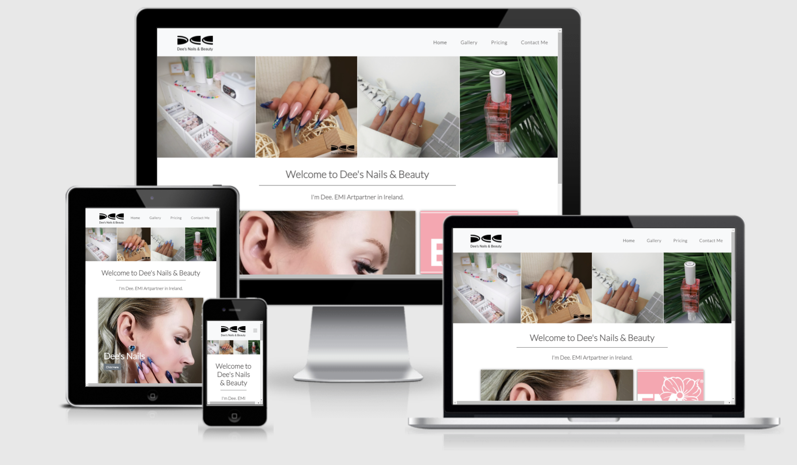

* [Click here](https://sandra-be.github.io/beauty_salon/) and view the live project.

# Table of contents

1. [Introduction](#Introduction)
2. [UX](#UX)
   * [Strategy](#Strategy)
      * [Website strategy](#Website-strategy)
      * [Target audience](#Target-audience)
      * [External Visitor's goal's](#External-Visitor's-goal's)
      * [Ideal client](#Ideal-client)
      * [Site Owner's goal's](#Site-Owner's-goal's)
   * [Scope](#Scope)
      * [User stories](#User-stories)
      * [Features](#Features)
      * [Content](#Content)
   * [Structure](#Structure)
      * [Site structure](#Site-structure)
   * [Skeleton](#Skeleton)
      * [Quick sketch](#Quick-sketch)
      * [Wireframes](#Wireframes)
   * [Design](#Design)
      * [Colour scheme](#Colour-scheme)
      * [Fonts](#Fonts)
      * [Media](#Media)
      * [Languages](#Languages)
      * [Technologies Used](#Technologies-Used) 
3. [Completed Live Site](#Completed-Live-Site)
   * [Existing features](#Existing-features) 
   * [Features to Implement in future](#Features-to-Implement-in-future)  
4. [Testing](#Testing)
   * [W3C Validation](#W3C-Validation)
   * [User stories testing](#User-stories-testing)
   * [Functional testing](#Function-testing)
5. [Deployment](#Deployment)
   * [Deploying on GitHub Pages](#Deploying-on-GitHub-Pages)
   * [Forking the Repository](#Forking-the-Repository)
   * [Creating a Clone](#Creating-a-Clone)
6. [Credits](#Credits)
   * [Images and text](#Images-and-text)
   * [Code](#Code)
   * [Helpfull sites](#Helpfull-sites)
   * [Acknowledgements](#Acknowledgements)

# Introduction

This website is built for the private salon by appointments only, providing a relaxed and peaceful atmosphere with a personal touch based on each client. The website features more insights about the salon, its products and offered proceduress, also a pricing list, and clear step-by-step form how to contact the salon.

Simple, easy, and understandable website for different age group clients providing them with clear expectation of provided procedures, prices in the salon as well call to take action - to arrange the call from salon for procedures.

This website tries to address the needs of clients to find all the information that they need to make a decision to contact salon.

# UX

## Strategy
### Website strategy

* Create online presence
* Promote buisiness
* Display gallery with nail designs
* Provide prices of procedures
* Provide contact option for clients
* Provide opportunity to download and save "Price List" on the device
* Provide social link for salon

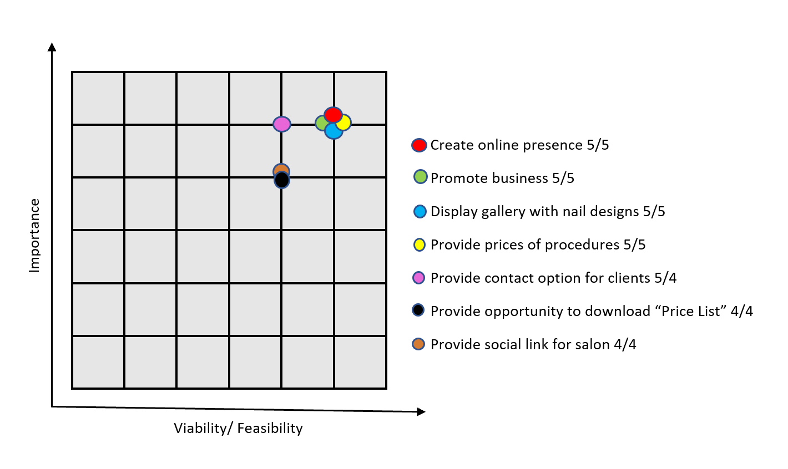

Existing and potencional clients were contacted via phone and questioned about potencional website for Dee's Nails & Beauty.
20 existing clients
18 potencional clients
Simple question were asked: "What would you like to see on website to get to know Dee's Nails & Beauty salon better?".
90% of all clients wanted to see images of the procedures and prices. 10% of clients were either not interested at that moment or knew already how to get in touch with Dee's Beauty & Nails salon.

### Target audience

* Clients looking for personal nail tehnician
* Clients looking for nail designs
* Existing clients
* Clients who follow fashion and newest trends
* Fashion bloggers
* Brides and bridesmaids

### External Visitor's goal's

* To find private type salon and atmosphere, personal approach and privacy
* To get inspiration for nail designs
* To find prices for procedures
* To find understandable information about products and brands are used
* To be able to navigate throughout the site to find any information
* To find a way how to contact salon for an appointment
* To locate link to social media for external resource

### Ideal client

* Client who has disposable income
* Client who likes to treat himself with the procedures
* Client who wants private one-to-one experience, atmosphere and personal approach
* English speaking clients
* Ireland based clients

### Site Owner's goal's

* Build awareness of the private salon and it’s exclusive brands and products
* Provide private procedures
* Build the loyal client base
* Drive the sales
* Provide contact form fron clients to contact salon
* Provide Social media link to external resource

## Scope
### User stories

1. As a new client to this website, I want to find information quick and easy navigating through website, so I can find what I need.
2. As a new client to this website, I want to get quality of the procedures are done, so I can trust in the service.
3. As a new client to this website, I want to learn more about beautician, so I can feel connection with person. 
4. As a new client, I want to view price list for procedures, so I can decide if I want to proceed with that.
5. As a new client, I want to know how to contact the beautician, so I know how to enquire the information.
6. As a client, I want to follow the salon media feed, so I can be up to date with latest information.

### Features

* Easy navigation throughout website to quickly find the information
* Nail design gallery with procedures description and price
* Separate Price List page with procedures description and price
* Contact Form to contact salon
* Link to external resource such as social media
* Link to open and download "Price List" for device in use
* Responsive design to be able target broader audiences

### Content

1. Header - showing on each page
   * Salon's Logo with responsive navigation bar
2. Hero image - showing on each page
   * Contains multiple images of salon's workplace, products and nail designs
3. Footer - showing on each page
   * Copyright text
   * Download link for "Price List"
   * Link to social media
4. Home page
   * Profile picture of private salon's owner
   * Button navigation to nails gallery
   * Used brand logos with button navigation to brand websites
5. Gallery page
   * Gallery of nail design images and description
6. Pricing page
   * Table with price list
7. Contact Me page
   * Contact Form

## Structure
### Site structure

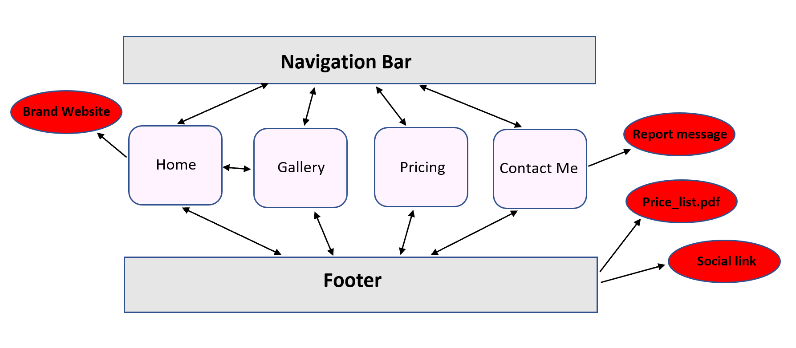

## Skeleton
### Quick sketch

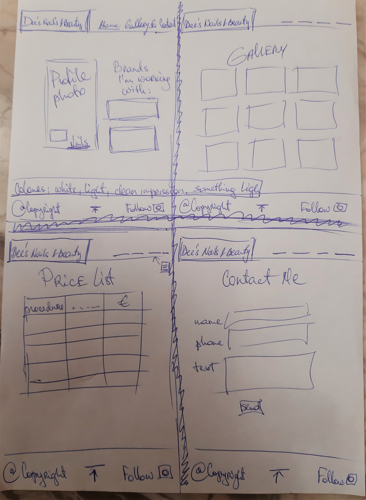

### Wireframes

[Home](assets/project_files/wireframes/home.pdf)

[Gallery](assets/project_files/wireframes/gallery.pdf)

[Pricing](assets/project_files/wireframes/pricing.pdf)

[Contact Me](assets/project_files/wireframes/contact.pdf) 

## Design
### Colour scheme

The colours throughout the website were kept light to show sterile, clean and a professional atmosphere of the salon. The images of the Nail designs are bright and colourful, which draw the clients attention to the website. The main idea is to have the clients attention on the Dee's Nails & Beauty designs, brand and workspace. 

### Fonts

LATO font is the main font for website and Sans Serif font is used as fallback.

### Media

Hero image with animation is designed to strike and catch the user's attention and gallery of nail designs with description and price helps to promote salon.

### Languages

This project uses [HTML5](https://en.wikipedia.org/wiki/HTML5) Hypertext Markup Language (HTML) and [CSS3](https://en.wikipedia.org/wiki/CSS) Cascading Style Sheets (CSS) programming languages.

### Technologies Used

* [Bootstrap4](https://getbootstrap.com/docs/4.1/getting-started/introduction/) - to simplify the structure of the website and make the website responsive easily.
* [Google Fonts](https://fonts.google.com/) - were used throughout the site.
* Icons on website were added with [Font Awesome](https://fontawesome.com/).
* [JQuery](https://jquery.com/) came with Bootstrap.
* [Popper.js](https://popper.js.org/) reference Javascript needed for the responsive navbar.
* Project code stored on [GitHub](https://github.com/).
* [gitpod.io](https://gitpod.io/workspaces) was used for coding.
* Wireframes were created on [Balsamiq](https://balsamiq.com/).

# Completed Live Site

* [Click here](https://sandra-be.github.io/beauty_salon/) and view the live project.

Each page features a responsive navigation bar which leads to right page and section of website. 
The **hero image** shows up in each page to atract clients with a positive emotions giving them the sence of professonalism and trusfull environment.
Each page has footer with copyright information, a "Price list" .pdf version available to download and save on device and social media icon linked to beauty salon social media page.

**Home**

The Home page is an introduction about beautician, a brand and workplace throughout pictures, which will attract clients. Brand images allow redirect clients to them main websites and discover more about brand.
Button on the profile picture is linked with gallery, so clients can see by themselves the artwork on the nails by Dee.

**Gallery**

The Gallery page is laid out into columns of card images with description. On the desktop gallery it's laid into 3 columns, tablet into 2 columns and mobile devices shows one picture. Each picture has description underneath of it. Viewing images with description will provide clients more knowledge about beauticians work. On the very bottom of gallery you will find the link which will help client to get back to the top of the page.

**Pricing**

The pricing page features one table, which list procedures, description of the procedures and a prices. Table is displayed on desktop on 70%, but on mobile devices it transforms into one column where rows are stacked on top of each other.

**Contact Me**

The Contact Me page features a contact form. Form requests clients name, contact mobile number and a textarea box to leave a message. The bottom of the form contains a Send Button and Reset Form Button.

## Existing features 

1. **Logo** of Dee's Nails & Beauty exists on every page and allows for all clients to easily recognise the business brand. Clicking on the logo clients are navigated to the home page as they would expect.
2. **Navigation Bar** is on every page and allows for all clients to easily navigate through all the website's pages and find what they are looking for quickly.
3. **Footer** Copyright Info on every page protects business copyright.
4. **Footer** Social Icon on every page allows for all clients to access the social platform for Dee's Nails & Beauty.
5. **Footer** Download Icon on every page allows for all clients to download and save "Price list" of the procedures of this private salon.
6. **Home Page** - profile picture of Dee shows a real personal connection and clients can connect with the nail tehnician and receive emotional response. Button on a profile picture navigate clients to gallery section. Brand logos are displayed on Home Page and buttons underneath navigate clients to brand websites.
7. **Gallery Page** - allows to view nail designs and price for procedure. That way clients will have better understanding about work Dee's private salon offers.
8. **Pricing Page** - lists all procedures and prices. Each procedure has description which explains what is done during this procedure.
9. **Contact Me Page** - offers client to send a brief message to nail tehnician.

## Features to Implement in future

1. In future website would have it's own booking system for clients.
2. More procedures will be offered on Dee's Nails & Beauty website. 
3. Separate platform for students/nail tehnicians to log in and learn about available courses. 
4. Online shop to purchase products.

# Testing

* Tested on Chrome and Firefox desktop version browsers.
* Chrome DevTools was used to test variety of devices such as Desktop, Laptop, iPhone7, iPhone 8, Galaxy S5 and iPad for responsiveness.
* Testing was done to ensure that layout and all Links were working correctly.

## W3C Validation

To validate every page of the project, that there were no syntax errors, were used W3C Validator and W3C CSS Validator. Files of .pdf format is available under each Validator link:

* [W3C Validator](assets/project_files/validators/w3c_validation.pdf)
* [W3C CSS Validator](assets/project_files/validators/w3c_css_validation.pdf)

## User stories testing

Each User story is tested throughout the website.

   > 1. As a new client to this website, I want to find information quick and easy navigating through website, so I can find what I need.

Navigation bar is implemented into website, so any new client is able to find information quick and easy.
This Navigation bar implemented on desktop, laptop and tablet:

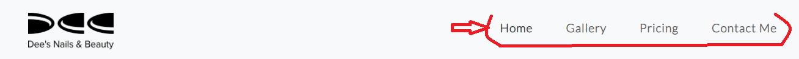

This Navigation bar implemented on mobile view:

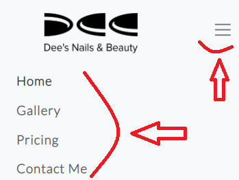

   > 2. As a new client to this website, I want to get quality of the procedures are done, so I can trust in the service.

Gallery page shows quality images of procedures and description, so any new client can see by themself and make a decision.

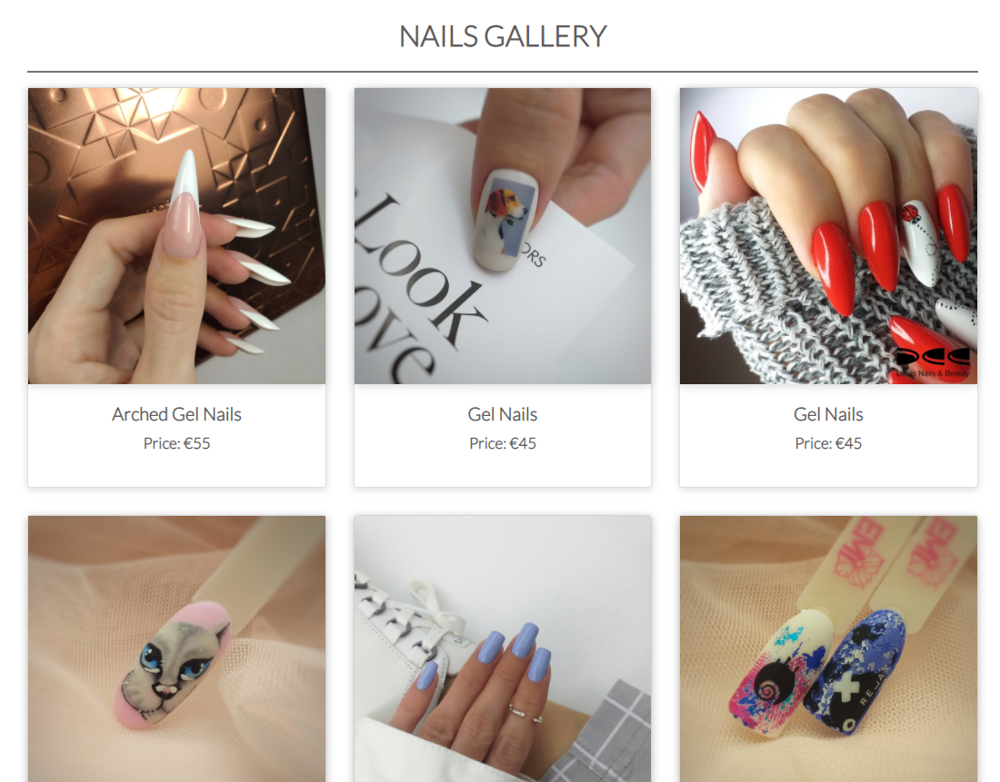

   > 3. As a new client to this website, I want to learn more about beautician, so I can feel connection with person.

Home page reviews beauticians profile picture, so any new client can see real person behind this service and can connect.

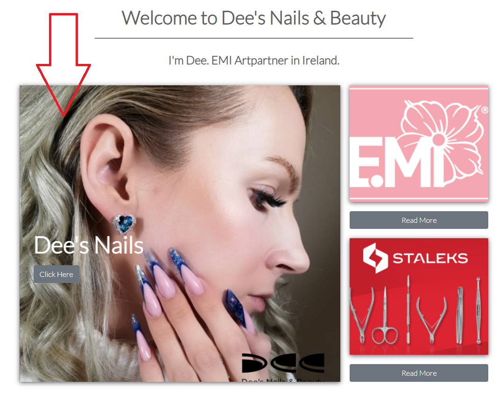

   > 4. As a new client, I want to view price list for procedures, so I can decide if I want to proceed with that.

Pricing page reviews a table with prices and also detailed description about procedures, also on the bottom of page any client has access to download "Price List" file for any device. From this any new client can decide if they want to proceed.

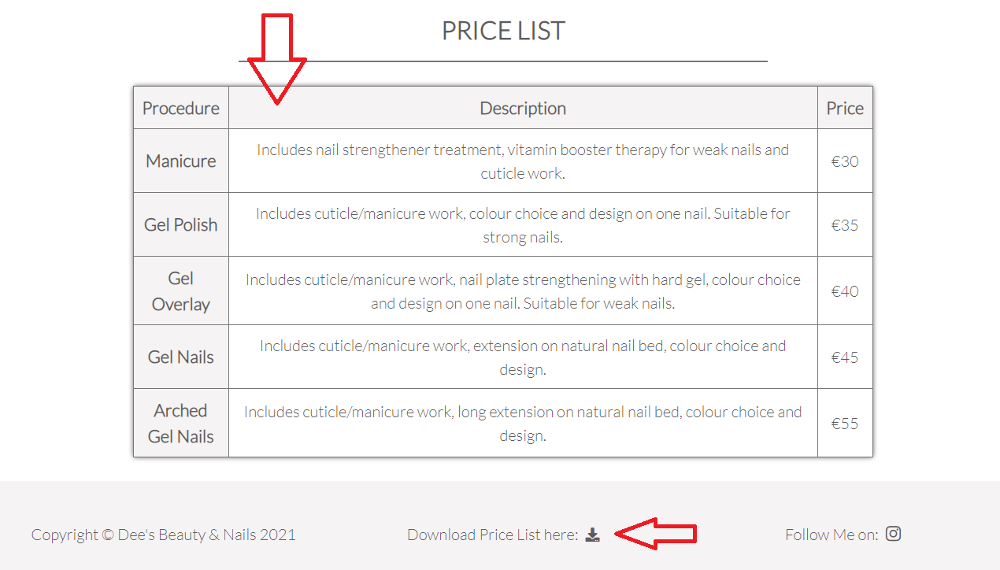

   > 5. As a new client, I want to know how to contact the beautician, so I know how to enquire the information.

Contact Me page represents contact form where any new client can enquire any information from beautician. Filling out the form and proceeding with Send button will generate report with thank you message and that beautician will be in contact with client as soon as possible. Unfortunately with my knowledge level at this moment message won't be sent to actual beautician, but this will be implemented in the future.

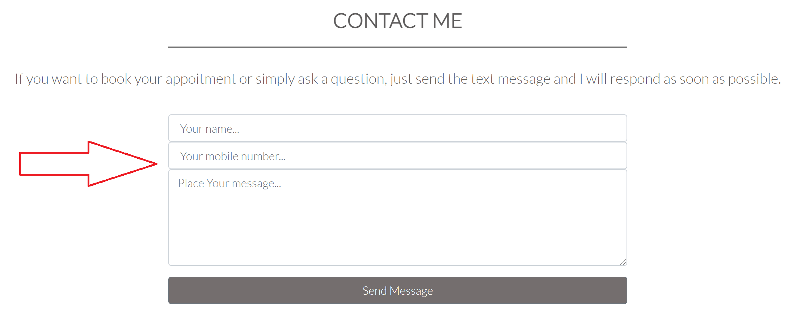

   > 6. As a client, I want to follow the salon media feed, so I can be up to date with latest information.

On each webpage footer section any client can find link to social media and  by clicking on it client will be redirected to beauticians social media feed, so any client can follow up with the latest information.

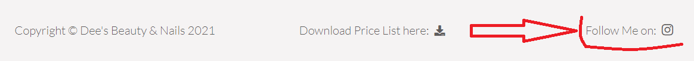

## Functional testing

Throughout website every link, button, icon and image was tested and all results are displayed in table below:

| Location | Type | Expected Result | Actual Result | Pass/Fail/Not executed|
| :----: | :----: | :----: | :----: | :----: |
| Header | Dee's Nails & Beauty *logo* image | Click on *Logo* navigates to Home page | Navigates to Home page | Pass |
| Header | *Home* link | Click on *Home* link navigates to Home page | Navigates to Home page | Pass |
| Header | *Gallery* link | Click on *Gallery* link navigates to Gallery page | Navigates to Gallery page | Pass |
| Header | *Pricing* link | Click on *Pricing* link navigates to Pricing page | Navigates to Pricing page | Pass |
| Header | *Contact Me* link | Click on *Contact Me* link navigates to Contact Me page | Navigates to Contact Me page | Pass |
| Footer | *Download icon* | Click on icon navigates to new page with price_list.pdf file in it | Navigates to new page with price_list.pdf file | Pass |
| Footer | *Instagram icon* | Click on icon navigates to Instagram social media feed | Navigates to Instagram social media feed | Pass |
| Home page | Button *Click here* on profile picture | Click on button navigates to Gallery page | Navigates to Gallery page | Pass |
| Home page | Button *Read More* underneath EMI Logo | Click on Button navigates to website www.https://shop.emischool.ie | Navigates to website www.https://shop.emischool.ie | Pass |
| Home page | Button *Read More* underneath STALEKS Logo | Click on Button navigates to website www.https://staleks.ie | Navigates to website www.https://staleks.ie | Pass |
| Gallery page | *Back to top* link | Click on link navigates to Gallery pages header | Navigates to Gallery pages header | Pass |
| Contact Me page | *Send* button | Click on button navigates to Report page | Navigates to Report page | Pass |
| Contact Me page | *Reset Form* button | Click on button clears all inserted information on form | Clears all inserted information on form | Pass |
| Report page | *Back to Contact Form* button | Click on button navigates to Contact Me page | Navigates to Contact Me page | Pass |
| Report page | *Back to Home* button | Click on button navigates to Home page | Navigates to Home page | Pass |

# Deployment

## Deploying on GitHub Pages

1. Log into [GitHub](https://github.com/) or [create an account](https://github.com/).
2. Locate the [GitHub Repository](https://sandra-be.github.io/beauty_salon/).
3. At the top of the repository, select Settings from the menu items.
4. Scroll down the Settings page to the "GitHub Pages" section.
5. Under "Source" click the drop-down menu labelled "None" and select "Master Branch".
6. Upon selection, the page will automatically refresh meaning that the website is now deployed.
7. Scroll back down to the "GitHub Pages" section to retrieve the deployed link.
8. At the time of submitting this Milestone project the Development Branch and Master Branch are identical.

## Forking the Repository

1. Log into [GitHub](https://github.com/) or [create an account](https://github.com/).
2. Locate the [GitHub Repository](https://sandra-be.github.io/beauty_salon/).
3. At the top of the repository, on the right side of the page, select "Fork".
4. You should now have a copy of the original repository in your GitHub account.

## Creating a Clone

1. Install the [GitPod Browser](https://www.gitpod.io/docs/browser-extension) Extension for Chrome.
2. After installation, restart the browser.
3. Log into [GitHub](https://github.com/) or [create an account](https://github.com/).
4. Locate the [GitHub Repository](https://sandra-be.github.io/beauty_salon/).
5. Click the green "GitPod" button in the top right corner of the repository. This will trigger a new gitPod workspace to be created from the code in github where you can work locally.

### How to run this project within a local IDE, such as VSCode

1. Log into [GitHub](https://github.com/) or [create an account](https://github.com/).
2. Locate the [GitHub Repository](https://sandra-be.github.io/beauty_salon/).
3. Under the repository name, click "Clone or download".
4. In the Clone with HTTPs section, copy the clone URL for the repository.
5. In your local IDE open the terminal.
6. Change the current working directory to the location where you want the cloned directory to be made.
7. Type 'git clone', and then paste the URL you copied in Step 3.

   > git clone https://github.com/USERNAME/REPOSITORY

8. Press Enter. Your local clone will be created.

Further reading and troubleshooting on cloning a repository from GitHub [here](https://docs.github.com/en/github/creating-cloning-and-archiving-repositories/cloning-a-repository).

# Credits

## Images and text

* The text for the Pricing page was created by Dee’s Nails & Beauty and edited by Sandra Berzkalna.
* The text for the rest of the website was created for Dee’s Nails & Beauty by Sandra Berzkalna.
* All photos used on this website were obtained from the beautician at Dee’s Nails & Beauty.

## Code

* CSS code for price list table for mobile devices was originally taken from [GlintPixel channel on YouTube](https://www.youtube.com/watch?v=_gKs9ht84uc) and then edited.
* The idea for gallery was originally taken [from Webseotips channel on YouTube](https://www.youtube.com/watch?v=gnDOjWUSHks) and then edited.
* Responsive Grid CSS layout using grid template areas for Home Page was originally taken from [Traversy Media channel on YouTube](https://www.youtube.com/watch?v=moBhzSC455o) and then modified.

## Helpfull sites

* [www.w3schools](https://www.w3schools.com/) - website for code tips.
* [Bootstrap4](https://getbootstrap.com/docs/4.1/layout/overview/) - Bootstrap Library was used to make site responsive.
* [stackoverflow.com](https://stackoverflow.com/) - website for code tips.
* [learn.codeinstutute.net](https://learn.codeinstitute.net/login?next=/) - HTML, CSS and Bootstrap study materials.
* [www.markdownguide.org](https://www.markdownguide.org/basic-syntax) - useful website for Markdown language creating README.md file.

## Acknowledgements 

* I received inspiration for this project from my sister who created this Dee’s Nails & Beauty Private Salon.
* My mentor for helpful feedback.
* Student support at Code Institute Slack platform for their support.

